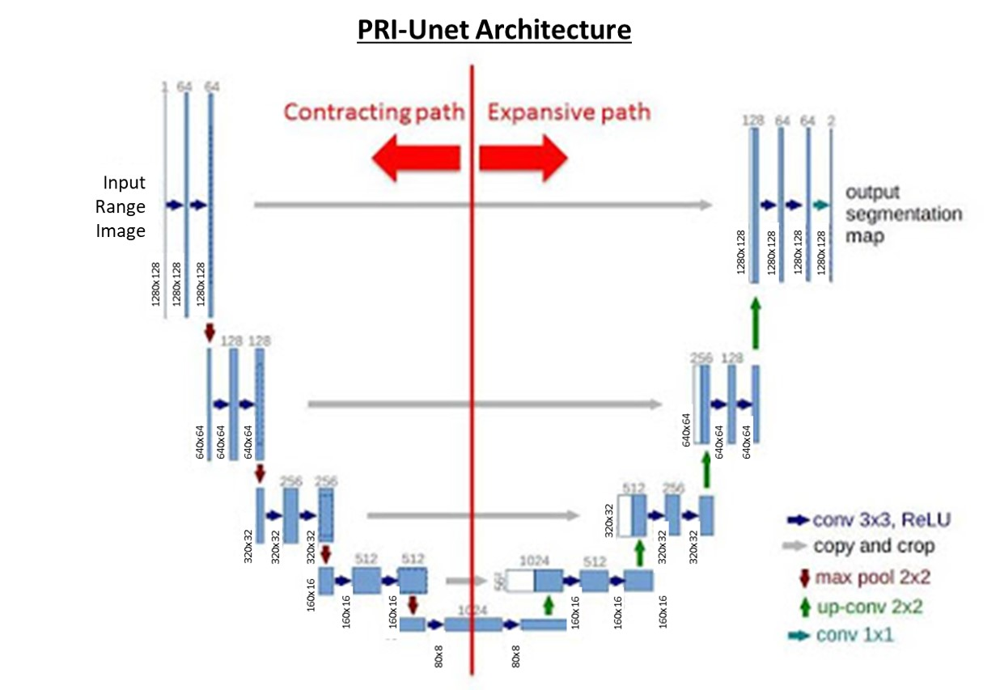

# PRI-Unet (Pure Range Image Unet)
U of M ROB530: Mobile Robotics Project for Winter 2020
The purpose of this project is to perform label segmentations on a range image extracted from a point cloud using a deep learning approach. The dataset that was used was the Segmantic KITTI datasets (seq 00-10).   
   
There were several steps that we took to accomplish this which will be outlined in this repository.  
* Result Plot with BKI Semantic
* Quantitative Results
* Prerequisites
* Generating Range Images
* Associating range image pixel with labels
* PRI-Unet (Pure Range Image Unet)
* Ground Truth and PRI-Unet Prediction

## Result Plot with BKI Semantic
Below are the plots of the trajectory and the map of the labeled point cloud data using BKI Semantics. Note that the trajectory are not plotted with equal axis for easier visualization. The point cloud map is plotted with equal axis.    
  
*Plots of ground truth pose for individual sequences*
  
*Maps generated through BKI Semantic for individual sequences*

## Quantitative results on SemanticKITTI dataset sequence 00-10 for 19 semantic classes. Pure Range Image Unet (PRI-Unet)

| Sequence  | Method | Car | Bicycle | Motorcycle | Truck | Other Vehicle | Person | Bicyclist | Motorcyclist | Road | Parking | Sidewalk | Other Ground | Building | Fence | Vegetation | Trunk | Terrain | Pole | Traffic Sign | Average | 
| --- | --- | --- | --- | --- | --- | --- | --- | --- | --- | --- | --- | --- | --- | --- | --- | --- | --- | --- | --- | --- | --- |
| 00 | PRI-Unet | 81.8 | **47.8** | 76.7 | 85.5 | 85.9 | 66.3 | 14.3 | n/a | 91.3 | 80.3 | 87.0 | **71.7** | 90.6 | 75.0 | 87.8 | 78.5 | 84.0 | 64.5 | 65.5 | 74.1 |
| | Da-kNN | 96.0 | 41.8 | **82.8** | 92.8 | **90.2** | **70.3** | 72.6 | 57.3 | **97.1** | **87.4** | **93.9** | 31.1 | **96.7** | **81.7** | **93.0** | **79.2** | **90.6** | **73.3** | **85.2** | **79.6** |
| | Sq.-KNN | 92.1 | 18.3 | 55.0 | 76.5 | 62.9 | 34.2 | 52.0 | 61.4 | 94.7 | 71.0 | 87.9 | 1.2 | 89.8 | 54.6 | 82.2 | 53.1 | 79.3 | 38.6 | 51.5 | 60.9 |
| | S-CMS | 95.6 | 23.5 | 69.8 | 88.3 | 74.4 | 47.9 | 71.6 | 56.9 | 96.3 | 78.1 | 91.2 | 3.1 | 93.6 | 64.2 | 87.4 | 70.1 | 83.5 | 61.1 | 70.7 | 69.9 |
| | S-BKI | **96.9** | 26.5 | 75.8 | **93.5** | 80.1 | 61.5 | **77.5** | **71.0** | 96.2 | 79.2 | 91.5 | 6.6 | 94.6 | 66.5 | 88.9 | 73.4 | 84.5 | 65.8 | 76.2 | 740 |
| 01 | PRI-Unet | 36.5 | n/a | n/a | **35.6** | 36.6 | **52.4** | n/a | n/a | 88.6 | **53.5** | **38.9** | 79.5 | 83.7 | 71.0 | 83.7 | **67.5** | 83.3 | 55.4 | 82.0 | 63.2 |
| | Da-kNN | 86.0 | n/a | n/a | n/a | n/a | n/a | n/a | 58.2 | **95.6** | n/a | n/a | **83.2** | **92.4** | **79.3** | **87.3** | 55.7 | **86.3** | **60.6** | **88.7** | **79.4** |
| | Sq.-KNN | 83.8 | n/a | n/a | n/a | 82.9 | n/a | n/a | 67.9 | 92.6 | n/a | n/a | 70.5 | 58.0 | 71.4 | 72.1 | 18.0 | 71.5 | 21.8 | 68.9 | 64.0 |
| | S-CMS | 89.8 | n/a | n/a | n/a | 91.0 | n/a | n/a | 70.3 | 93.4 | n/a | n/a | 74.2 | 64.4 | 73.8 | 75.1 | 26.3 | 74.7 | 31.9 | 78.7 | 70.3 |
| | S-BKI | **91.0** | n/a | n/a | n/a | **96.0** | n/a | n/a | **70.7** | 94.3 | n/a | n/a | 75.2 | 67.1 | 75.1 | 76.4 | **30.6** | 76.1 | 36.2 | 81.4 | 72.5 |
| 02 | PRI-Unet | 81.7 | **47.5** | 72.1 | **76.3** | 83.7 | 68.9 | n/a | n/a | 91.5 | 83.3 | 87.6 | **76.2** | 89.4 | 84.1 | 91.1 | **79.0** | 81.6 | **66.1** | 62.7 | **77.8** | 
| | Da-kNN | 95.2 | 29.2 | **81.9** | n/a | **87.7** | **69.8** | **2.3** | 75.4 | **96.8** | **88.7** | **92.4** | 75.5 | **92.7** | **85.2** | **93.4** | 75.3 | **88.0** | 63.7 | **73.8** | 75.9 |
| | Sq.-KNN | 90.9 | 14.5 | 50.8 | n/a | 56.4 | 38.6 | n/a | 59.9 | 93.9 | 68.1 | 84.9 | 50.9 | 79.1 | 66.1 | 82.5 | 48.9 | 68.3 | 25.7 | 35.9 | 59.7 |
| | S-CSM | 95.4 | 28.5 | 73.4 | n/a | 80.3 | 60.3 | n/a | 75.1 | **94.8** | 74.4 | **87.4** | 61.7 | 85.0 | 71.8 | 86.7 | 66.9 | 72.9 | 43.5 | 55.7 | 71.4 |
| | S-BKI | **95.8** | 31.1 | 76.4 | n/a | 83.3 | 62.5 | n/a | **79.5** | 94.8 | 75.0 | 87.4 | 63.6 | 85.6 | 72.1 | 87.1 | 68.8 | 73.4 | 45.9 | 60.4 | 73.1 |
| 03 | PRI-Unet | 83.5 | **43.4** |	**54.7** | 62.7 | 82.6 | **64.5** | n/a	| n/a |	91.7 | 74.4 |	86.6 | **76.1** |	88.0 | 80.8 |	91.5 | **75.5** |	87.9 |	66.4 |	64.4 |	75.0 |
| | Da-kNN | 94.3 | 39.3 | n/a | **71.2** | **88.9** | 47.3 | n/a | n/a | **97.1** | **82.8** | **93.5** | n/a | **93.0** | **88.0** | **95.1** | 64.5 | **92.2** | **72.2** | **78.2** | **79.8** |
| | Sq.-KNN | 88.4 | 21.9 | n/a | 12.4 | 60.1 | 16.3 | n/a | n/a | 92.8 | 57.9 | 83.2 | n/a | 77.4 | 70.1 | 79.3 | 41.6 | 62.3 | 35.9 | 47.3 | 56.5 |
| | S-CSM | 92.4 | 29.7 | n/a | 23.1 | 65.4 | 17.6 | n/a | n/a | **94.3** | 69.4 | 86.9 | n/a | 80.4 | 73.8 | 83.2 | 52.3 | 66.9 | 53.5 | 62.0 | 63.4 |
| | S-BKI | **94.5** | 42.4 | n/a | 48.8 | 73.6 | 23.8 | n/a | n/a | 94.3 | 73.2 | 87.2 | n/a | 82.1 | 74.7 | 84.1 | 55.7 | 67.4 | 57.3 | 66.7 | 68.4 |
| 04 | PRI-Unet | 74.4 |	n/a |	**18.0** | **49.8** | 52.2 | 33.8 |	n/a	| n/a | 94.6 | 59.8 | 80.7 | 77.3 |	88.1 | 87.9 |	92.0 | **54.3** |	81.5 | 65.3 | 70.2 | 67.5 |
| | Da-kNN | **90.0** | n/a | n/a | n/a | **91.5** | **43.3** | n/a | n/a | **98.5** | **72.8** | **88.3** | **80.7** | **92.2** | **92.8** | **93.6** | 31.2 | **88.8** | **71.9** | **74.2** | **79.3** |
| | Sq.-KNN | 84.9 | n/a | n/a | n/a | 68.1 | 20.8 | n/a | n/a | 95.8 | 26.1 | 68.4 | 61.5 | 49.3 | 76.4 | 82.6 | 14.0 | 67.6 | 36.0 | 44.6 | 56.9 |
| | S-CSM | **88.3** | n/a | n/a | n/a | 71.2 | 23.2 | n/a | n/a | **96.5** | 40.5 | **72.5** | 64.0 | 52.1 | 78.5 | 85.5 | 19.4 | 72.5 | 50.8 | 57.6 | 62.3 |
| | S-BKI | 87.7 | n/a | n/a | n/a | 82.5 | 37.3 | n/a | n/a | 96.2 | 55.7 | 72.3 | 68.3 | 56.9 | 80.3 | 87.1 | 24.4 | 72.7 | 55.5 | 67.0 | 67.4 |
| 05 | PRI-Unet | 81.3 | **54.5** |	60.9 | 89.7 |	**87.5** | **71.5** |	n/a |	0.0 |	91.8 | 89.5 |	84.8 | 75.4 |	87.6 | 75.0 |	83.9 | **72.3** |	69.3 |	62.3 | 66.1 |	76.6 |
| | Da-kNN | 91.0 | 46.5 | **61.2** | **92.5** | 53.5 | 65.5 | 70.0 | n/a | **97.3** | **93.7** | **92.1** | **84.8** | **94.7** | **87.4** | **89.2** | 64.9 | **79.1** | **69.8** | **78.8** | **78.4** |
| | Sq.-KNN | 89.1 | 8.6 | 15.4 | 82.5 | 70.9 | 31.0 | 55.0 | n/a | 94.7 | 84.8 | 85.0 | 61.5 | 87.0 | 72.4 | 75.5 | 30.3 | 64.6 | 27.6 | 39.5 | 59.7 |
| | S-CSM | **93.4** | 15.4 | 28.9 | 86.4 | 78.4 | 39.8 | 69.4 | n/a | 96.4 | 90.1 | 88.5 | 70.0 | 90.9 | 77.7 | 81.2 | 46.8 | 69.5 | 47.6 | 57.4 | 68.2 |
| | S-BKI | 93.2 | 27.4 | 46.0 | 89.0 | 84.1 | 47.5 | **83.3** | n/a | 94.2 | 88.0 | 83.6 | 75.2 | 92.4 | 75.3 | 82.1 | 53.5 | 69.5 | 50.2 | 63.3 | 72.1 |
| 06 | PRI-Unet | 82.6 | **49.6** |	**74.7** | 91.2 |	**86.6** | 64.2 |	n/a |	n/a |	89.8 | 77.9 |	84.3 | 81.6 | 87.2 | 65.1 |	80.6 | **59.9** |	91.6 | 65.3 |	75.5 | 76.9 |
| | Da-kNN | 93.5 | 46.0 | 72.1 | 72.8 | 65.0 | **70.8** | 79.1 | n/a | **94.8** | **83.1** | **89.3** | **85.7** | **95.6** | **78.0** | **84.4** | 56.3 | **94.4** | **75.9** | 83.7 | **78.9** |
| | Sq.KNN | 85.4 | 17.1 | 50.2 | 86.7 | 66.1 | 27.6 | 64.3 | n/a | 87.6 | 56.0 | 74.9 | 66.5 | 83.9 | 38.4 | 61.9 | 32.0 | 89.5 | 40.1 | 52.7 | 60.1 |
| | S-CSM | 91.8 | 22.7 | 62.5 | 89.8 | 75.4 | 43.3 | 92.1 | n/a | 91.1 | 68.2 | 80.4 | 70.5 | 89.4 | 49.3 | 69.7 | 50.1 | 92.2 | 60.0 | 77.9 | 70.9 |
| | S-BKI | **92.6** | 28.7 | 67.9 | **93.5** | 81.4 | 62.7 | **95.4** | n/a | 90.3 | 70.7 | 79.9 | 71.8 | 91.7 | 53.6 | 73.7 | 54.7 | 91.9 | 66.4 | **84.8** | 75.1 |
| 07 | PRI-Unet | 82.3 | **51.7** |	84.3 | 91.0 |	89.0 | 71.5 |	n/a |	n/a |	91.6 | 81.7 |	87.5 | 32.6 |	91.9 | 74.0 |	86.1 | 78.6 |	86.4 | 66.9 |	68.5 | 77.4 |
| | Da-kNN | **96.1** | 44.6 | **87.6** | **91.1** | **93.9** | **76.8** | 79.8 | n/a | **97.0** | **88.8** | **94.6** | n/a | **97.1** | **81.6** | **89.4** | 76.9 | **91.0** | **75.0** | **86.9** | **85.2** | 
| | Sq.-KNN | 92.4 | 21.3 | 64.0 | 83.6 | 69.8 | 53.2 | 63.6  | n/a | 93.9 | 75.9 | 89.3 | n/a | 90.9 | 59.7 | 76.5 | 45.9 | 82.8 | 40.2 | 54.0 | 68.1 |
| | S-CSM | 94.9 | 25.9 | 76.8 | 82.6 | 81.5 | 64.2 | 88.0 | n/a | **95.8** | 80.9 | 92.0 | n/a | 93.8 | 66.6 | 80.8 | 59.8 | 84.7 | 55.4 | 73.2 | 76.3 |
| | S-BKI | 93.8 | 29.2 | 80.2 | 82.7 | 87.8 | 70.1 | **92.7** | n/a | 93.9 | 77.0 | 87.7 | n/a | 94.1 | 63.4 | 81.4 | **84.1** | 84.5 | 53.2 | 77.6 | 78.4 |
| 08 | PRI-Unet | 81.9 | **47.5** |	**72.6** | **88.0** |	**85.2** | **68.7** | 45.6 | **70.9** |	91.2 | **81.5** |	**86.1** | **72.1** | 86.3 | **81.4** |	**88.2** | **75.1** |	**85.6** | **65.7** |	**68.4** |	**75.9** |
| | Da-kNN | 91.0 | 25.0 | 47.1 | 40.7 | 25.5 | 45.2 | **62.9** | n/a | **93.8** | 46.5 | 81.9 | 2.0 | 85.8 | 54.2 | 84.2 | 52.9 | 72.7 | 53.2 | 40.0 | 55.8 |
| | Sq.-KNN | 86.7 | 14.4 | 24.6 | 21.0 | 23.3 | 23.5 | 40.9 | n/a | 90.1 | 32.4 | 74.8 | 1.2 | 79.6 | 42.7 | 79.2 | 36.5 | 71.1 | 28.3 | 24.8 | 44.2 |
| | S-CSM | 90.5 | 23.0 | 34.9 | 26.8 | 29.1 | 32.4 | 49.4 | n/a | 92.6 | 38.7 | 79.0 | 1.1 | 84.6 | 51.6 | 83.3 | 48.3 | 72.9 | 44.1 | 31.6 | 50.8 |
| | S-BKI | **92.3** | 30.0 | 39.7 | 29.3 | 32.1 | 38.8 | 54.7 | n/a | 92.9 | 40.9 | 79.9 | 1.1 | **86.6** | 54.6 | 84.9 | 52.3 | 74.2 | 47.9 | 34.7 | 53.7 |
| 09 | PRI-Unet | 83.9 | **37.9** |	76.2 | 88.6 | **87.9** | **75.1** |	n/a	| n/a	| 91.6 | 82.8 |	86.4 | **76.3** |	88.3 | 79.5 |	90.0 | **73.5** |	82.0 | 61.7 |	74.9 | **78.6** |
| | Da-kNN | 90.9 | 34.9 | 77.4 | 85.1 | 37.6 | 52 | n/a | n/a | **96.3** | **85.9** | **91.3** | 75.5 | **94.1** | **86.4** | **91.9** | 57.6 | **85.3** | **72.3** | **82.3** | 76.3 |
| | Sq.-KNN | 89.2 | 5.3 | 48.0 | 79.8 | 61.3 | 37.3 | n/a | n/a | 91.0 | 59.0 | 79.9 | 38.9 | 80.9 | 62.9 | 77.0 | 32.3 | 61.7 | 31.8 | 52.6 | 58.2 |
| | S-CSM | 93.9 | 12.2 | 71.9 | 85.6 | 71.6 | 47.5 | n/a | n/a | 91.8 | 67.0 | 83.1 | 23.4 | 88.9 | 65.7 | 82.6 | 42.9 | 64.9 | 52.4 | 53.0 | 64.6 |
| | S-BKI | **96.0** | 22.8 | **80.2** | **90.5** | 79.7 | 60.7 | n/a | n/a | 91.7 | 70.0 | 83.8 | 30.7 | 90.8 | 69.1 | 84.0 | 46.3 | 66.0 | 59.1 | 58.2 | 69.4 
| 10 | PRI-Unet | 81.0 | **46.9** |	69.3 | 83.3 |	**86.4** | 75.4 | n/a	| n/a	| 91.4 | 82.6 |	86.0 | **67.2** |	89.1 | 81.6 |	88.0 | **73.7** |	80.7 | 64.2 |	65.0 |	77.2 |
| | Da-kNN | **95.1** | 43.8 | **72.1** | **93.5** | 66.2 | **76.1** | n/a | n/a | **96.9** | **89.2** | **93.0** | 63.6 | **94.0** | **87.5** | **91.7** | 64.3 | **86.5** | **69.8** | **76.0** | **80.0** |
| | Sq.-KNN | 84.0 | 8.1 | 36.2 | 49.3 | 10.2 | 40.9 | n/a | n/a | 89.4 | 59.6 | 78.5 | 42.7 | 76.7 | 64.2 | 77.6 | 29.0 | 67.8 | 30.7 | 47.9 | 52.5 |
| | S-CSM | 91.0 | 14.6 | 51.8 | 67.7 | 16.6 | 52.8 | n/a | n/a | 92.1 | 69.7 | 83.7 | 51.3 | 81.7 | 70.0 | 82.2 | 43.3 | 72.4 | 51.7 | 64.1 | 62.2 |
| | S-BKI | 93.8 | 24.6 | 60.3 | 76.2 | 21.2 | 65.0 | n/a | n/a | 92.3 | 73.4 | 84.8 | 54.5 | 83.0 | 71.2 | 83.4 | 47.3 | 73.4 | 56.2 | 67.9 | 66.4 |
| Average | PRI-Unet | 77.4 |	**47.4** | 66.0 |	76.5 | **78.5** |	**64.8** | 29.9 |	70.9 | 91.4 |	77.0 | 81.5 |	**71.4** | 88.2 |	77.8 | 87.5 |	**71.6** |	83.1 | 64.0 |	69.4 | 72.3 |
| | Da-kNN | 92.7 | 39.0 | **72.8** | **80.0** | 70.0 | 62.3 | 61.1 | 63.6 | **96.4** | **81.9** | **91.0** | 64.5 | **93.5** | **82.0** | **90.3** | 61.7 | **86.8** | **68.9** | **77.1** | **75.6** |
| | Sq.-KNN | 87.9 | 14.4 | 43.0 | 61.5 | 57.5 | 32.3 | 55.2 | 63.1 | 92.4 | 59.1 | 80.7 | 43.9 | 77.5 | 61.7 | 76.9 | 34.7 | 71.5 | 32.4 | 47.2 | 57.5 |
| | S-CSM | 92.5 | 21.7 | 58.7 | 68.8 | 66.8 | 42.9 | 74.1 | 67.4 | 94.1 | 67.7 | 84.5 | 46.6 | 82.3 | 67.5 | 81.6 | 47.8 | 75.2 | 50.2 | 62.0 | 65.9 |
| | S-BKI | **93.4** | 29.2 | 65.8 | 75.4 | 72.9 | 93.0 | **80.7** | **73.7** | 93.7 | 72.3 | 83.8 | 49.0 | 84.1 | 68.7 | 83.0 | 53.7 | 75.8 | 54.0 | 67.1 | 72.1 |

## Prerequisites
* Docker (Optional, Recommended as their might be version conflicts with pre-existing packages installed in your computer)
* Ubuntu 16.04
* Eigen 3.2.5
* VTK-7.1.0
* Flann 1.8
* Boost 1.58
* Google Colab
There are several other prerequisites for the prepocessing and running the RangeImageUnet code which are described below.

### Preprocess (Range Image)
The range images were created using PCL (Point Cloud Library) which is an open-source library of algorithms for point cloud processing tasks. PCL can be run using either C++ or python and for this project our team compiled using C++. Outlined below are the necesarry files and libraries that need to be installed:  

* Install oracle-java8-jdk:
```
sudo add-apt-repository -y ppa:webupd8team/java && sudo apt update && sudo apt -y install oracle-java8-installer
```
* Install universal pre-requisites:
```
sudo apt -y install g++ cmake cmake-gui doxygen mpi-default-dev openmpi-bin openmpi-common libusb-1.0-0-dev libqhull* libusb-dev libgtest-dev
sudo apt -y install git-core freeglut3-dev pkg-config build-essential libxmu-dev libxi-dev libphonon-dev libphonon-dev phonon-backend-gstreamer
sudo apt -y install phonon-backend-vlc graphviz mono-complete qt-sdk libflann-dev   
```
* Install libflann and libboost
```
sudo apt -y install libflann1.8 libboost1.58-all-dev  
```

* Install libeigen
```
cd ~/Downloads
wget http://launchpadlibrarian.net/209530212/libeigen3-dev_3.2.5-4_all.deb
sudo dpkg -i libeigen3-dev_3.2.5-4_all.deb
sudo apt-mark hold libeigen3-dev
```

* Install VTK
```
wget http://www.vtk.org/files/release/7.1/VTK-7.1.0.tar.gz
tar -xf VTK-7.1.0.tar.gz
cd VTK-7.1.0 && mkdir build && cd build
cmake ..
make                                                                   
sudo make install
```

* Install PCL (This takes a while ...)
```
cd ~/Downloads
wget https://github.com/PointCloudLibrary/pcl/archive/pcl-1.8.0.tar.gz
tar -xf pcl-1.8.0.tar.gz
cd pcl-pcl-1.8.0 && mkdir build && cd build
cmake ..
make
sudo make install
```  

## Generating Range Images
The .cpp files specifically write_rimg_bin.cpp and write_rimg_labels.cpp are used to generate the range images and the parameters will be explained below. The files that generated the range images can be found in the folder **"src"**   
Below is an example of a point cloud visualized through PCL that will be used to generate the range image.
    
*Example Point Cloud*
### Angular Resolution
The angular resolution for both x and y axis have been set to 0.31 degrees to limit the size of the range image. The KITTI dataset contain lidar point cloud data with an angular resolution of 0.09 degrees. However this created a range image that was nearly 4000 x 530 pixels. Due to the limitation of Google Colab in terms of GPU RAM and disk space, the range images generated needed to be tuned to 0.31 degrees to generate an image that was 1280 x 128 pixels.  
    
*0.09 Deg Resolution Range Image*
   
*0.31 Deg Resolution Range Image*
### Coordinate Frame
LASER_FRAME was used instead of IMAGE_FRAME
### Max Angle Height and Width 
The maximum angle height and width were set to the following:
* Maximum Angle Width: 360.0f 
* Maximum Angle Height: 180.0f

A maximum angle width of 360 degree ensures that the range images that were generated was from the full scan.   
A maximum angle width of 180 degree generates range images from half the scan.   


## Associating range image pixel with labels
Given the generated range image, the labels associated with each range image pixel was computed using a KD tree. A KD tree was generated from the point cloud data. The range image stores the x,y,z coordinate in each pixel and using a KD tree search, the nearest point and its index were found. The label was then extracted by the found index from the .label files from the KITTI Segmented dataset (as the the .bin and .label files have corresponding indices).
   
*Range Images. On the top the range image visualized through range. On the bottom the range image visualized through labels*

## PRI-Unet (Pure Range Image Unet)
The deep learning architecture for this was used using the Unet architecture. The code for this can be found under the folder **"Colab"**   
   
*PRI-Unet Architecture which follows the Unet Architecture*   
The model was trained using the following sequences which were further split into 80-20 for training and validation:
* Seq 01
* Seq 04 
* Seq 05
* Seq 06 
* Seq 07
* Seq 09   
The following sequences were used as these sequences were the smaller sequences and due to the limited RAM to train our network (due to using Colab).

## Ground Truth and PRI-Unet Prediction
The accuracy of our model is seen in the table presented at the very beginning.   
An example of the prediction can be seen below.   

   
*Point Cloud Label. The first figure is the Ground Truth Point Cloud Data from Range Image. The second is the Predicted Point Cloud Data from Range Images*
